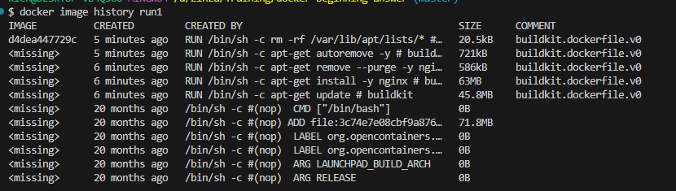
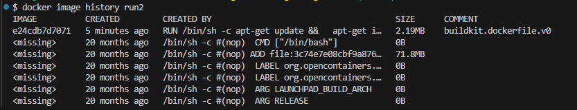

1. Ý nghĩa các câu lệnh:
- docker build: Build một image
- docker search: Search image trên dockerhub
- docker pull: download image từ dockerhub về local
- docker push: push image từ local lên dockerhub
- docker images: danh sách các image
- docker ps: danh sách các container
- docker run: Chạy một container từ image
- docker exec: thực thi một câu lệnh trong một container đang chạy
- docker attach: gán terminal của host vào một container đang chạy
- docker cp: Copy file giữa máy host và container
- docker logs: Đọc logs của container
- docker history: lịch sử của image

##Docker build
1. Cách chỉ định dockerfile: Sử dụng option -t Tên_file của lệnh docker build
2. 
    - Thời gian lần 1: 
        - real 1m10.275s
    - Thời gian lần 2
        - real 3.512s

Thời gian chạy lần 2 nhanh hơn lần 1 là do docker đã sử dụng cache để bỏ qua layer 2, từ đó build nhanh hơn

3. Đổi tên thành image
- Thời gian chạy
    - 52.795s

Sau khi đổi tên, thời gian chạy đã tăng lên. Nguyên nhân là do layer trước đã thay đổi nên ở layer sau, cache bị invalidate nên phải tạo lại layer

4. 
Dung lượng của 2 image: 
- run1: 265MB
- run2: 100MB
Có sự khác nhau là do cách viết câu lệnh. run1.Dockerfile viết các câu lệnh RUN riêng biệt, dẫn đến việc tạo ra số layer ứng với số câu lệnh RUN. run2.Dockerfile viết câu lệnh RUN kết hợp với && nên sẽ chỉ tạo ra 1 layer ở bước RUN, giảm được dung lượng 
Chi tiết layer: 

##Docker run
Ý nghĩa các arguments
- --name: Đặt tên cho container 
- -i, --interactive: Giữ cho container có thể nhận input từ commandline
- -t, --tty: Tạo một terminal ảo cho phép người dùng nhập lệnh để tương tác với container
- -d: Chạy container mà không gán với terminal của người dùng, chỉ in ra container id
- -e, --env, --env-file: Chỉ định biến môi trường
- -p, --publish: Mở cổng từ container đến host
- --restart: chiến lược restart cho container
- --rm: Tự động xóa container khi nó bị tắt

